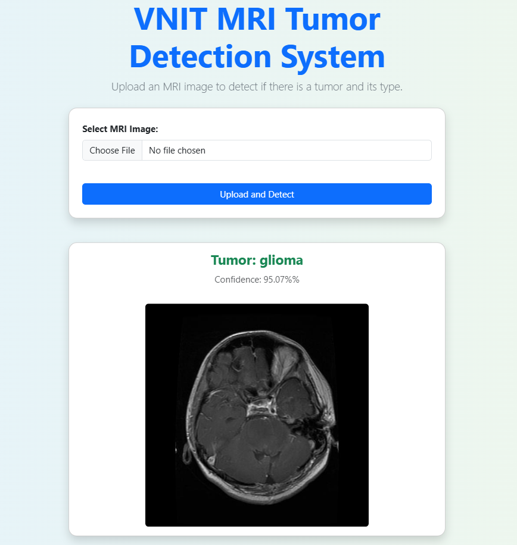

# Optimized Brain Tumor Detection: A Dual-Module Approach for for MRI Image Enhancement and Tumor Classification

This project presents a dual-module system for detecting brain tumors in MRI scans. The system is designed to first enhance MRI images using image processing techniques and then classify them using a deep learning model. A user-friendly web interface built using Flask allows users to upload MRI scans and view predictions in real time.

🔗 GitHub Repository: [https://github.com/AbhishekDeshmukh0444/Brain-Tumour-Detection](https://github.com/AbhishekDeshmukh0444/Brain-Tumour-Detection)

## 🔍 Project Overview

- **Module 1: MRI Image Enhancement**  
  Applies contrast enhancement techniques (e.g., CLAHE) to improve MRI quality before classification.

- **Module 2: Tumor Classification**  
  A Convolutional Neural Network (CNN)-based model is used to classify the MRI scan as Glioma , Meningioma , Pituitary and No Tumor.

## 📌 Features

- Upload and process MRI images via a Flask web interface.
- Automatically enhances MRI images for better feature extraction.
- Predicts presence of a tumor using a trained deep learning model.
- Displays enhanced image and prediction result to the user.

## 📁 Dataset

The dataset consists of MRI images with trained and tested images labeled as "Glioma","Meningioma","Pituitary" and "No Tumor". Preprocessing steps include:
- Resizing to uniform dimensions
- Normalization
- Data augmentation (if applicable)

## 📦 Software Requirements

- **Python 3.8+**
- **Operating System**: Windows 10/11, Linux (Ubuntu 20.04+), or macOS
- **Libraries/Frameworks**:
  - Flask
  - TensorFlow / Keras
  - NumPy
  - OpenCV
  - scikit-learn
  - Matplotlib

To install all dependencies, run:
```bash
pip install -r requirements.txt
```

## 💻 Hardware Requirements

- Minimum 4 GB RAM (8 GB recommended)
- Intel i3 processor or equivalent (i5 or above recommended)
- GPU (optional, for faster model inference)
- Disk Space: ~1 GB for models and data

---

## 🚀 How to Execute the Code

### 1. Clone the Repository

```bash
git clone https://github.com/AbhishekDeshmukh0444/Brain-Tumour-Detection.git
cd Brain-Tumour-Detection
```

### 2. Set Up the Environment (Optional but Recommended)

```bash
python -m venv venv
source venv/bin/activate  # On Windows: venv\Scripts\activate
```

### 3. Install Dependencies

```bash
pip install -r requirements.txt
```

### 4. Run the Flask App

```bash
python app.py
```

Then open your browser and go to:  
```
http://127.0.0.1:5000
```

### 5. Upload MRI Scan

- Upload an MRI image via the interface.
- The system enhances the image and predicts:
  - **Glioma Tumor**
  - **Meningioma Tumor**
  - **Pituitary Tumor**
  - **No Tumor**

---

## 🧪 Model Summary

- **Input**: 128x128 RGB MRI image
- **Architecture**: CNN with multiple convolution + pooling layers
- **Output**: Softmax layer for 4-class classification
- **Training**: Categorical Crossentropy loss with Adam optimizer

---

## 📈 Sample Evaluation Metrics

| Tumor Type       | Precision | Recall | F1 Score |
|------------------|-----------|--------|----------|
| Glioma           | 94.1%     | 95.0%  | 94.5%    |
| Meningioma       | 92.6%     | 93.2%  | 92.9%    |
| Pituitary Tumor  | 96.8%     | 95.7%  | 96.2%    |
| No Tumor         | 97.1%     | 96.4%  | 96.7%    |


## 📷 Sample Output

- Upload MRI image  
- View enhanced image  
- View tumor prediction result (Type of Tumor)

## 🚀 Future Work

- Deploying the model on Heroku or AWS
- Improving prediction accuracy and UI responsiveness

## 👥 Contributors

- **Utkarsh Gaikwad**  
- **Akash Devmore**  
- **Abhishek Deshmukh**  
- **Pratik Karode**

Final Year, Electronics and Communication Engineering  
VNIT Nagpur

## 📜 License

This project is licensed under the MIT License. See the [LICENSE](LICENSE) file for details.
